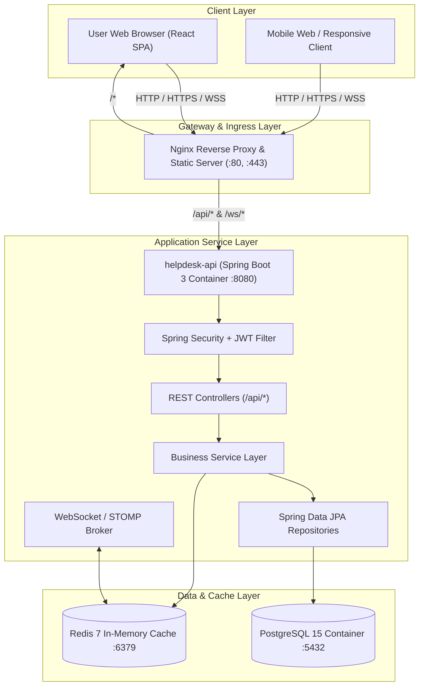

# HelpDesk System - Architecture & Deployment Specification

## 1. System Overview

Hệ thống **HelpDesk** được thiết kế theo mô hình kiến trúc phân lớp hiện đại (Layered / Clean Architecture), phục vụ quy trình tiếp nhận, quản lý và xử lý ticket hỗ trợ kỹ thuật, dịch vụ nội bộ và khách hàng.

### Công nghệ cốt lõi:
- **Backend**: Spring Boot 3.2.x (Java 17), Spring Security 6, Spring Data JPA, Hibernate, WebSocket (STOMP).
- **Frontend**: React (Vite, TypeScript, Tailwind CSS / Ant Design / Shadcn UI).
- **Database**: PostgreSQL 15 (Relational storage, ACID, indexing, JSONB support).
- **Cache & Message Broker**: Redis 7 (Session/Token blacklist, real-time message bus, fast lookups).
- **Proxy / Gateway**: Nginx Reverse Proxy (SSL termination, load balancing, path routing).
- **Containerization**: Docker & Docker Compose.

---

## 2. Logical Architecture Diagram



---

## 3. Physical Deployment Diagram

```mermaid
graph TB
    subgraph HostServer [Host Machine / Cloud VM (Docker Engine)]
        subgraph DockerBridgeNetwork [Docker Network: helpdesk-network]
            direction TB
            NginxContainer["Container: helpdesk-nginx\n(Port 80/443 -> Host 80/443)"]
            FrontendContainer["Container: helpdesk-frontend\n(Nginx serving built React static files)"]
            BackendContainer["Container: helpdesk-backend\n(Spring Boot 3 JRE 17, Port 8080)"]
            PostgresContainer["Container: helpdesk-postgres\n(PostgreSQL 15, Volume: postgres_data)"]
            RedisContainer["Container: helpdesk-redis\n(Redis 7, Volume: redis_data)"]
        end
    end

    Client([Clients / Browsers]) -->|HTTP :80 / HTTPS :443| NginxContainer
    NginxContainer -->|Proxy Pass /| FrontendContainer
    NginxContainer -->|Proxy Pass /api & /ws| BackendContainer
    BackendContainer -->|JDBC :5432| PostgresContainer
    BackendContainer -->|RESP :6379| RedisContainer
```

---

## 4. Security & Authentication Architecture

1. **Stateless JWT Flow**:
   - Client gửi thông tin đăng nhập tới `/api/auth/login`.
   - Backend xác thực credentials, phát sinh cặp Access Token (JWT signed HMAC-SHA256).
   - Mọi request tiếp theo đính kèm header `Authorization: Bearer <token>`.
   - `JwtAuthenticationFilter` chặn các request, trích xuất token, validate chữ ký và nạp `UserDetails` vào `SecurityContextHolder`.

2. **Role-Based Access Control (RBAC)**:
   - Hỗ trợ các vai trò: `ROLE_USER`, `ROLE_AGENT`, `ROLE_ADMIN`.
   - Phân quyền tại method level bằng `@PreAuthorize("hasRole('ADMIN')")`.

3. **Rate Limiting & Token Blacklisting**:
   - Tích hợp Redis để quản lý refresh token và danh sách token đã thu hồi (blacklist).

---

## 5. Development & Production Environment Profiles

| Tham số | Profile: `dev` | Profile: `prod` |
|---|---|---|
| Database URL | `jdbc:postgresql://localhost:5432/helpdesk_db` | `jdbc:postgresql://postgres:5432/helpdesk_db` |
| Hibernate DDL | `update` | `validate` |
| Show SQL | `true` (formatted) | `false` |
| Hikari Pool | Default | `max-pool-size: 20, min-idle: 5` |
| Redis Host | `localhost:6379` | `redis:6379` (Docker internal DNS) |

---

## 6. Hướng dẫn khởi chạy nhanh (Quick Start)

### 1. Khởi chạy toàn bộ hệ thống bằng Docker:
```bash
cp .env.example .env
docker compose up -d --build
```

### 2. Khởi chạy Backend riêng cho Local Dev:
```bash
# Bật database và cache nền tảng
docker compose up -d postgres redis

# Chạy Spring Boot API
cd helpdesk-api
./mvnw spring-boot:run
```

- Swagger UI: `http://localhost:8080/api/swagger-ui.html`
- API Docs: `http://localhost:8080/api/v3/api-docs`
