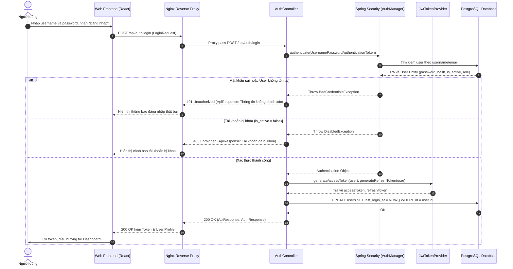
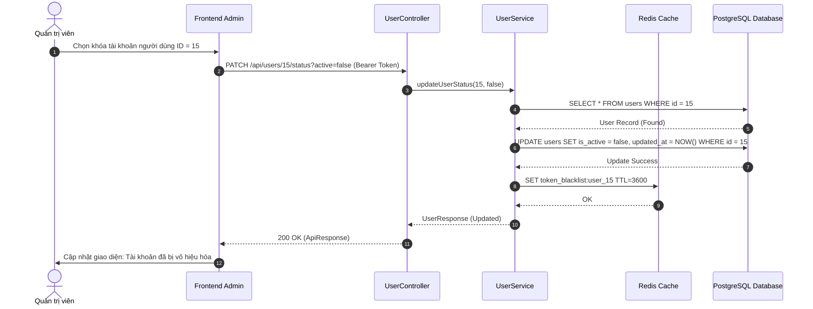
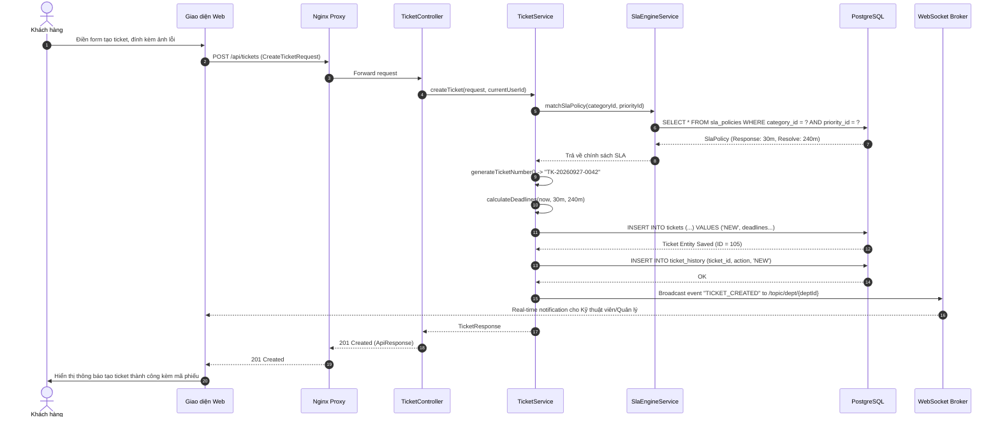
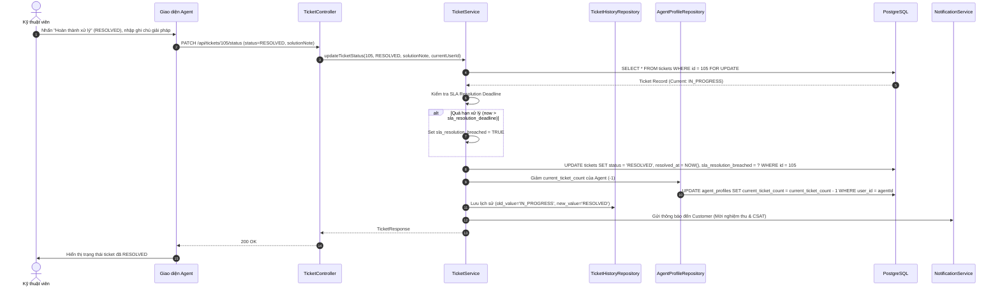
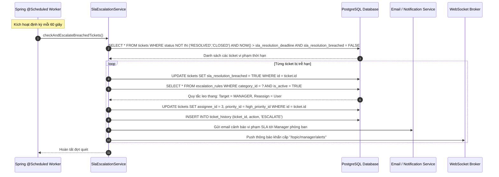

# Đặc Tả Chức Năng Và Use Case Hệ Thống HelpDesk Enterprise

> **Tài liệu:** Báo cáo Phân tích & Đặc tả Yêu cầu Chức năng (Chương 2)  
> **Dự án:** HelpDesk Management System  
> **Người thực hiện:** TV3 (Backend Support + Test + Docs)  
> **Đối tượng áp dụng:** CUSTOMER, AGENT, MANAGER, ADMIN  
> **Phiên bản:** 1.0.0  
> **Ngày lập:** 2026-09-27  

---

## MỤC LỤC

1. [TỔNG QUAN TÁC NHÂN (ACTORS) VÀ MA TRẬN PHÂN QUYỀN](#1-tổng-quan-tác-nhân-actors-và-ma-trận-phân-quyền)
2. [DANH MỤC 10 NHÓM YÊU CẦU CHỨC NĂNG (YC1 - YC10)](#2-danh-mục-10-nhóm-yêu-cầu-chức-năng-yc1---yc10)
3. [ĐẶC TẢ CHI TIẾT CÁC USE CASE VÀ SEQUENCE DIAGRAM](#3-đặc-tả-chi-tiết-các-use-case-và-sequence-diagram)
   - [YC1: Quản Lý Xác Thực & Phân Quyền](#yc1-quản-lý-xác-thực--phân-quyền)
   - [YC2: Quản Lý Người Dùng & Phòng Ban](#yc2-quản-lý-người-dùng--phòng-ban)
   - [YC3: Quản Lý Danh Mục Sự Cố & Mức Độ Ưu Tiên](#yc3-quản-lý-danh-mục-sự-cố--mức-độ-ưu-tiên)
   - [YC4: Quản Lý Chính Sách Cam Kết Mức Độ Dịch Vụ (SLA)](#yc4-quản-lý-chính-sách-cam-kết-mức-độ-dịch-vụ-sla)
   - [YC5: Tiếp Nhận & Phân Công Phiếu Yêu Cầu (Ticket Assignment)](#yc5-tiếp-nhận--phân-công-phiếu-yêu-cầu-ticket-assignment)
   - [YC6: Xử Lý & Quản Lý Vòng Đời Phiếu Hỗ Trợ (Ticket Lifecycle)](#yc6-xử-lý--quản-lý-vòng-đời-phiếu-hỗ-trợ-ticket-lifecycle)
   - [YC7: Trao Đổi Bình Luận & Quản Lý Tệp Tin Đính Kèm](#yc7-trao-đổi-bình-luận--quản-lý-tệp-tin-đính-kèm)
   - [YC8: Giám Sát Vi Phạm SLA & Tự Động Leo Thang (Escalation)](#yc8-giám-sát-vi-phạm-sla--tự-động-leo-thang-escalation)
   - [YC9: Khảo Sát Đánh Giá Chất Lượng Dịch Vụ (CSAT Feedback)](#yc9-khảo-sát-đánh-giá-chất-lượng-dịch-vụ-csat-feedback)
   - [YC10: Cơ Sở Tri Thức (Knowledge Base) & Báo Cáo Thống Kê](#yc10-cơ-sở-tri-thức-knowledge-base--báo-cáo-thống-kê)

---

## 1. TỔNG QUAN TÁC NHÂN (ACTORS) VÀ MA TRẬN PHÂN QUYỀN

### 1.1. Danh Sách Tác Nhân Hệ Thống
1. **Khách hàng (CUSTOMER):** Người dùng nội bộ công ty hoặc khách hàng sử dụng dịch vụ. Có nhu cầu gửi ticket, trao đổi bình luận, tra cứu tài liệu hỗ trợ và chấm điểm dịch vụ.
2. **Kỹ thuật viên hỗ trợ (AGENT):** Thành viên các phòng ban kỹ thuật/dịch vụ (IT, Network, HR, Kế toán). Có trách nhiệm tiếp nhận, phân tích, xử lý kỹ thuật, trao đổi ghi chú nội bộ và phản hồi giải pháp cho ticket.
3. **Trưởng bộ phận / Quản lý (MANAGER):** Người quản lý đội ngũ Agent trong phòng ban. Có thẩm quyền phân công ticket, tái điều phối, phê duyệt leo thang sự cố, theo dõi vi phạm SLA và hiệu suất xử lý.
4. **Quản trị viên hệ thống (ADMIN):** Quản lý cấu hình toàn cục, tài khoản người dùng, cơ cấu tổ chức phòng ban, danh mục sự cố, cấu hình SLA và chính sách leo thang.
5. **Hệ thống tự động (SYSTEM / CRON WORKER):** Tiến trình nền tự động tính toán thời hạn SLA, kiểm tra ngưỡng vi phạm và thực hiện kích hoạt leo thang sự cố, gửi thông báo real-time qua WebSocket và Email.

---

## 2. DANH MỤC 10 NHÓM YÊU CẦU CHỨC NĂNG (YC1 - YC10)

| Mã YC | Tên Nhóm Yêu Cầu | Phạm Vi Chức Năng Chính | Tác Nhân Chính |
|:---:|:---|:---|:---:|
| **YC1** | Quản lý Xác thực & Phân quyền | Đăng nhập JWT, Đăng ký Customer, Làm mới Token, Đổi/Quên mật khẩu, Thu hồi phiên | All Actors |
| **YC2** | Quản lý Người dùng & Phòng ban | CRUD User, Khóa/Mở tài khoản, Quản lý Agent Profile (skills, capacity), CRUD Phòng ban | Admin, Manager |
| **YC3** | Quản lý Danh mục & Độ ưu tiên | Cấu hình Category đa cấp, gán phòng ban xử lý mặc định, Cấu hình Priority và trọng số | Admin |
| **YC4** | Quản lý Chính sách SLA | Thiết lập ma trận thời gian phản hồi/xử lý (Category x Priority), Tự động tính hạn chót | Admin, Manager |
| **YC5** | Tiếp nhận & Phân công Ticket | Tạo Ticket, tự động sinh mã `TK-YYYYMMDD-XXXX`, Phân công thủ công, Tự nhận (Claim), Round-robin | Customer, Agent, Manager |
| **YC6** | Xử lý Vòng đời Ticket | Chuyển đổi trạng thái `NEW` -> `ASSIGNED` -> `IN_PROGRESS` -> `PENDING` -> `RESOLVED` -> `CLOSED`, ghi Audit Log | Agent, Manager, Customer |
| **YC7** | Trao đổi & Tệp đính kèm | Bình luận công khai, Ghi chú nội bộ (`is_internal = true`), Upload file đa định dạng, giới hạn 10MB | All Actors |
| **YC8** | Giám sát SLA & Tự động Leo thang | Bộ quét định kỳ vi phạm deadline phản hồi/xử lý, Reassign sang Manager/Admin, Gửi cảnh báo đa kênh | System Worker |
| **YC9** | Khảo sát Hài lòng CSAT & Feedback | Gửi form đánh giá 1-5 sao sau khi giải quyết ticket, Tính toán điểm rating trung bình Agent | Customer, System |
| **YC10** | Cơ sở Tri thức & Báo cáo Thống kê | Quản lý bài viết FAQ/Giải pháp, Tìm kiếm full-text, Báo cáo KPI, Tỷ lệ SLA Breach, Biểu đồ CSAT | All Actors, Manager, Admin |

---

## 3. ĐẶC TẢ CHI TIẾT CÁC USE CASE VÀ SEQUENCE DIAGRAM

### YC1: QUẢN LÝ XÁC THỰC & PHÂN QUYỀN

#### Use Case UC-01: Đăng nhập hệ thống (JWT Authentication)
- **Tác nhân:** CUSTOMER, AGENT, MANAGER, ADMIN
- **Mục đích:** Xác thực danh tính người dùng và cấp cặp token JWT (Access Token & Refresh Token) để truy cập các tài nguyên được bảo vệ.
- **Tiền điều kiện (Precondition):** Tài khoản đã tồn tại trong bảng `users` và có cờ `is_active = TRUE`.
- **Luồng sự kiện chính (Main Flow):**
  1. Người dùng nhập `username` (hoặc `email`) và `password` tại màn hình Đăng nhập.
  2. Client gửi request `POST /api/auth/login` tới Backend.
  3. Spring Security `AuthenticationManager` kiểm tra thông tin đăng nhập với Password Encoder (BCrypt).
  4. Hệ thống kiểm tra trạng thái kích hoạt của tài khoản.
  5. Hệ thống sinh Access Token (thời hạn 1 giờ, chứa `userId`, `username`, `role`) và Refresh Token (thời hạn 7 ngày).
  6. Hệ thống cập nhật trường `last_login_at = CURRENT_TIMESTAMP` trong cơ sở dữ liệu.
  7. Backend trả về HTTP 200 kèm `AuthResponse` chứa tokens và thông tin cơ bản của User.
  8. Client lưu Access Token vào bộ nhớ ứng dụng và điều hướng vào trang Dashboard tương ứng với Role.
- **Luồng rẽ nhánh / Ngoại lệ (Alternative Flows):**
  - *2a. Dữ liệu đầu vào không hợp lệ:* Hệ thống trả về HTTP 400 Bad Request kèm thông báo lỗi cụ thể (ví dụ: username không được để trống).
  - *3a. Sai tên đăng nhập hoặc mật khẩu:* Hệ thống trả về HTTP 401 Unauthorized (`Mã lỗi: AUTH_INVALID_CREDENTIALS`).
  - *4a. Tài khoản bị vô hiệu hóa (`is_active = FALSE`):* Hệ thống trả về HTTP 403 Forbidden (`Mã lỗi: AUTH_ACCOUNT_DISABLED`).
- **Hậu điều kiện (Postcondition):** Người dùng đăng nhập thành công, phiên làm việc được thiết lập, Security Context lưu trữ thông tin xác thực.

---

#### Use Case UC-02: Đăng ký tài khoản khách hàng (Customer Registration)
- **Tác nhân:** CUSTOMER vãng lai
- **Tiền điều kiện:** Username và Email chưa tồn tại trong hệ thống.
- **Luồng sự kiện chính (Main Flow):**
  1. Người dùng nhập thông tin: `username`, `email`, `password`, `fullName`, `phoneNumber`.
  2. Client gửi `POST /api/auth/register`.
  3. Hệ thống kiểm tra tính duy nhất của `username` và `email`.
  4. Mã hóa mật khẩu bằng thuật toán BCrypt với salt độ dài 10 rounds.
  5. Tạo mới bản ghi trong bảng `users` với vai trò mặc định `role = 'CUSTOMER'`, `is_active = TRUE`.
  6. Backend trả về HTTP 201 Created kèm thông báo đăng ký thành công.
- **Luồng rẽ nhánh:**
  - *3a. Username hoặc Email đã tồn tại:* Hệ thống ném ngoại lệ `ConflictException` (HTTP 409) và thông báo lỗi trùng lặp dữ liệu.
- **Postcondition:** Tài khoản mới được ghi nhận vào cơ sở dữ liệu và có thể đăng nhập ngay.

---

### YC2: QUẢN LÝ NGƯỜI DÙNG & PHÒNG BAN

#### Use Case UC-03: Quản lý người dùng (CRUD & Trạng thái tài khoản)
- **Tác nhân:** Quản trị viên (ADMIN)
- **Tiền điều kiện:** ADMIN đã xác thực với JWT hợp lệ.
- **Luồng sự kiện chính (Main Flow):**
  1. ADMIN truy cập menu "Quản lý Người dùng" (`GET /api/users?page=0&size=10&role=AGENT`).
  2. Hệ thống hiển thị danh sách người dùng phân trang, kèm bộ lọc theo phòng ban, vai trò, trạng thái.
  3. ADMIN thực hiện tạo tài khoản kỹ thuật viên/quản lý mới:
     - Nhập form tạo người dùng và chọn phòng ban trực thuộc.
     - Client gửi `POST /api/users`.
     - Backend lưu bản ghi User. Nếu role là `AGENT`, hệ thống đồng thời tạo bản ghi khởi tạo trong `agent_profiles` (`max_active_tickets = 5`, `current_ticket_count = 0`, `is_available = true`).
  4. Khi cần khóa tài khoản: ADMIN kích hoạt toggle trạng thái, gửi `PATCH /api/users/{id}/status?active=false`.
  5. Hệ thống cập nhật `is_active = false` và đẩy token của user đó vào danh sách đen (Redis Blacklist) để vô hiệu hóa phiên ngay lập tức.
- **Hậu điều kiện:** Thông tin tài khoản được cập nhật; người dùng bị khóa không thể thực hiện bất kỳ request API nào.

---

#### Use Case UC-04: Quản lý cơ cấu phòng ban (Department Management)
- **Tác nhân:** ADMIN
- **Mục đích:** Thiết lập các phòng ban chuyên môn (IT HelpDesk, Infrastructure, HR, Tài chính) để điều phối ticket.
- **Tiền điều kiện:** ADMIN đăng nhập thành công.
- **Luồng chính:** ADMIN tạo mới phòng ban (`code`, `name`, `description`, `manager_id`). Hệ thống kiểm tra tính duy nhất của mã phòng ban `code`, kiểm tra `manager_id` phải là tài khoản có role `MANAGER`. Lưu vào bảng `departments`.
- **Luồng ngoại lệ:** Nếu `code` đã tồn tại -> 409 Conflict. Nếu `manager_id` không tồn tại hoặc không phải `MANAGER` -> 400 Bad Request.

---

### YC3: QUẢN LÝ DANH MỤC SỰ CỐ & MỨC ĐỘ ƯU TIÊN

#### Use Case UC-05: Cấu hình danh mục sự cố đa cấp (Categories)
- **Tác nhân:** ADMIN
- **Mô tả:** Hệ thống hỗ trợ cây danh mục phân cấp cha-con (ví dụ: *Phần mềm* -> *Hệ điều hành Windows* / *Phần mềm Office*) và gắn kết với Phòng ban xử lý mặc định.
- **Main Flow:**
  1. ADMIN gửi `POST /api/categories` với payload gồm `code`, `name`, `department_id`, `parent_id` (nếu là danh mục con).
  2. Hệ thống kiểm tra `department_id` hợp lệ và `parent_id` (nếu có) phải tồn tại trong DB.
  3. Lưu danh mục mới vào DB.
- **Postcondition:** Danh mục hiển thị trên giao diện tạo ticket của Khách hàng.

#### Use Case UC-06: Quản lý bảng mức độ ưu tiên (Priorities)
- **Tác nhân:** ADMIN
- **Mô tả:** Quản lý các cấp độ ưu tiên (LOW, MEDIUM, HIGH, CRITICAL, URGENT) kèm trọng số `level_weight` và màu sắc hiển thị `color_hex`.
- **Ràng buộc nghiệp vụ:** Mỗi mức độ ưu tiên có `level_weight` duy nhất để làm căn cứ tính toán thứ tự ưu tiên xử lý trong hàng đợi của kỹ thuật viên.

---

### YC4: QUẢN LÝ CHÍNH SÁCH CAM KẾT MỨC ĐỘ DỊCH VỤ (SLA)

#### Use Case UC-07: Thiết lập và áp dụng chính sách SLA
- **Tác nhân:** ADMIN, MANAGER
- **Tiền điều kiện:** Danh mục và Mức độ ưu tiên đã được tạo.
- **Luồng chính:**
  1. Người quản lý truy cập cấu hình SLA (`/admin/sla-policies`).
  2. Nhập các tham số:
     - Tên chính sách (ví dụ: *SLA Xử lý sự cố Khẩn cấp Phần mềm*).
     - Danh mục áp dụng (`category_id`).
     - Độ ưu tiên (`priority_id`).
     - Thời gian phản hồi lần đầu cam kết: `first_response_time_minutes` (ví dụ: 15 phút).
     - Thời gian xử lý dứt điểm cam kết: `resolution_time_minutes` (ví dụ: 120 phút).
  3. Gửi `POST /api/sla-policies`.
  4. Hệ thống kiểm tra không trùng lặp cặp (`category_id`, `priority_id`) đang active, lưu vào bảng `sla_policies`.
- **Hậu điều kiện:** Mọi ticket mới phát sinh thỏa mãn Category & Priority tương ứng sẽ tự động gắn `sla_policy_id` này.

---

### YC5: TIẾP NHẬN & PHÂN CÔNG PHIẾU YÊU CẦU (TICKET ASSIGNMENT)

#### Use Case UC-08: Khách hàng tạo phiếu yêu cầu mới (Ticket Creation)
- **Tác nhân:** CUSTOMER
- **Mục đích:** Gửi sự cố/yêu cầu hỗ trợ tới đội ngũ kỹ thuật.
- **Tiền điều kiện:** Khách hàng đã đăng nhập.
- **Luồng sự kiện chính (Main Flow):**
  1. Khách hàng bấm "Tạo Ticket mới", nhập tiêu đề, nội dung chi tiết, chọn Category và mức độ ưu tiên mong muốn, đính kèm tệp mô tả lỗi.
  2. Client gửi `POST /api/tickets` (Multipart Form hoặc JSON kèm tệp).
  3. Backend TicketService tiếp nhận:
     - Sinh mã ticket duy nhất theo định dạng `TK-YYYYMMDD-XXXX` (sử dụng sequence atomic).
     - Xác định `department_id` dựa trên `category_id`.
     - Tìm kiếm `sla_policy` phù hợp nhất theo `(category_id, priority_id)`.
     - Tính toán hai mốc thời hạn:
       + `sla_response_deadline = created_at + sla_policy.first_response_time_minutes`
       + `sla_resolution_deadline = created_at + sla_policy.resolution_time_minutes`
     - Lưu Ticket ở trạng thái `NEW`.
     - Nếu có file đính kèm, lưu file vào kho lưu trữ và tạo bản ghi `ticket_attachments`.
     - Ghi nhận lịch sử vào `ticket_history` (`action = 'CREATE'`).
  4. Hệ thống gửi thông báo Notification (in-app & WebSocket) tới Manager của phòng ban phụ trách.
  5. Trả về thông tin Ticket vừa tạo (HTTP 201 Created).
- **Ngoại lệ:**
  - *3a. Không tìm thấy SLA Policy cụ thể:* Hệ thống áp dụng chính sách SLA mặc định của hệ thống.
  - *3b. Tệp đính kèm vượt quá 10MB hoặc sai định dạng cho phép:* Trả về 400 Bad Request.

---

#### Use Case UC-09: Phân công và Tiếp nhận Ticket (Manual Assignment & Self Claim)
- **Tác nhân:** MANAGER, AGENT
- **Tiền điều kiện:** Ticket đang ở trạng thái `NEW` hoặc `ASSIGNED`.
- **Trường hợp 1 (Manager gán việc):**
  1. MANAGER xem danh sách ticket chưa phân công của phòng ban.
  2. Chọn ticket và chọn Kỹ thuật viên (AGENT) từ danh sách nhân viên khả dụng (`is_available = true` và `current_ticket_count < max_active_tickets`).
  3. Gửi `PUT /api/tickets/{id}/assign` với `assigneeId`.
  4. Backend cập nhật `assignee_id = assigneeId`, đổi trạng thái ticket sang `ASSIGNED`.
  5. Tăng `current_ticket_count` của Agent lên 1 trong `agent_profiles`.
  6. Ghi vết vào `ticket_history`.
  7. Bắn WebSocket thông báo trực tiếp cho Agent được phân công.
- **Trường hợp 2 (Agent tự nhận việc - Claim Ticket):**
  1. AGENT xem danh sách hàng đợi chung của phòng ban.
  2. Bấm "Nhận xử lý" (Claim Ticket).
  3. Hệ thống kiểm tra số lượng ticket đang nhận của Agent có vượt quá `max_active_tickets` không. Nếu không, gán `assignee_id = currentUserId`, chuyển trạng thái `ASSIGNED`.

---

### YC6: XỬ LÝ & QUẢN LÝ VÒNG ĐỜI PHIẾU HỖ TRỢ (TICKET LIFECYCLE)

#### Use Case UC-10: Cập nhật tiến độ và trạng thái Ticket
- **Tác nhân:** AGENT, MANAGER, CUSTOMER
- **Sơ đồ máy trạng thái (State Machine):**
  - `NEW` -> `ASSIGNED` -> `IN_PROGRESS` <-> `PENDING` -> `RESOLVED` -> `CLOSED`
  - Bất kỳ trạng thái nào (trước khi Resolved) -> `CANCELLED`
- **Main Flow (Agent xử lý và hoàn tất):**
  1. AGENT mở ticket được giao, bấm "Bắt đầu xử lý" -> gửi `PATCH /api/tickets/{id}/status` với `status = 'IN_PROGRESS'`.
  2. Khi Agent gửi phản hồi đầu tiên cho khách: Hệ thống tự động ghi nhận mốc `first_responded_at = NOW()`.
     - Kiểm tra nếu `first_responded_at > sla_response_deadline` -> gán `sla_response_breached = TRUE`.
  3. Nếu cần chờ khách hàng phản hồi thêm thông tin: Agent chuyển trạng thái sang `PENDING`.
  4. Khi sự cố đã được sửa chữa: Agent chọn `RESOLVED`, nhập giải pháp khắc phục.
     - Hệ thống ghi nhận `resolved_at = NOW()`.
     - Kiểm tra nếu `resolved_at > sla_resolution_deadline` -> gán `sla_resolution_breached = TRUE`.
     - Giảm `current_ticket_count` của Agent trong `agent_profiles` đi 1.
  5. Hệ thống gửi email & thông báo cho Customer mời xác nhận và đánh giá.
  6. Khách hàng bấm "Đóng phiếu" hoặc sau 48 giờ hệ thống tự động chuyển `status = 'CLOSED'` và gán `closed_at = NOW()`.

---

### YC7: TRAO ĐỔI BÌNH LUẬN & QUẢN LÝ TỆP TIN ĐÍNH KÈM

#### Use Case UC-11: Trao đổi bình luận (Public & Internal Notes)
- **Tác nhân:** CUSTOMER, AGENT, MANAGER
- **Tiền điều kiện:** Người dùng có quyền truy cập vào ticket tương ứng.
- **Ràng buộc bảo mật:**
  - CUSTOMER: Chỉ xem và gửi được các comment công khai (`is_internal = false`). Tuyệt đối không đọc được comment nội bộ.
  - AGENT, MANAGER, ADMIN: Có thể bật cờ `is_internal = true` để trao đổi chuyên môn riêng giữa các kỹ thuật viên.
- **Main Flow:**
  1. Người dùng nhập nội dung comment tại màn hình chi tiết ticket.
  2. Gửi `POST /api/tickets/{id}/comments` kèm `content` và `is_internal`.
  3. Backend kiểm tra quyền của người dùng hiện tại (nếu Customer gửi `is_internal = true` thì hệ thống cưỡng chế gán về `false`).
  4. Lưu bình luận vào bảng `ticket_comments`.
  5. Bắn thông báo real-time qua WebSocket topic `/topic/tickets/{id}/comments` (chỉ gửi tin nội bộ đến kênh phân quyền của nhân viên).

---

#### Use Case UC-12: Tải lên và Quản lý tệp đính kèm (Attachments)
- **Tác nhân:** CUSTOMER, AGENT, MANAGER
- **Mô tả:** Đính kèm hình ảnh chụp màn hình lỗi, file log hệ thống, tài liệu PDF.
- **Quy tắc kiểm tra an toàn (Validation Rules):**
  - Dung lượng file tối đa: 10MB / file.
  - Định dạng cho phép (Whitelisted MIME Types): `image/jpeg`, `image/png`, `image/gif`, `application/pdf`, `text/plain`, `application/zip`, `application/x-zip-compressed`.
  - Tên file được sanitize loại bỏ các ký tự đặc biệt nguy hiểm (chống path traversal `../`). File được lưu với UUID định danh trên ổ đĩa vật lý hoặc S3-compatible storage.
  - Lưu thông tin vào bảng `ticket_attachments`.

---

### YC8: GIÁM SÁT VI PHẠM SLA & TỰ ĐỘNG LEO THANG (ESCALATION)

#### Use Case UC-13: Quét định kỳ phát hiện vi phạm SLA và tự động leo thang
- **Tác nhân:** Hệ thống tự động (SLA Scheduled Worker / Cron Job)
- **Tần suất chạy:** Mỗi 1 phút một lần (`@Scheduled(cron = "0 * * * * *")`).
- **Luồng sự kiện chính (Main Flow):**
  1. Scheduled Worker kích hoạt tác vụ kiểm tra SLA.
  2. Truy vấn DB tìm các ticket thỏa mãn điều kiện:
     - `status IN ('NEW', 'ASSIGNED', 'IN_PROGRESS', 'PENDING')`
     - VÀ (`first_responded_at IS NULL AND NOW() > sla_response_deadline` HOẶC `NOW() > sla_resolution_deadline`).
  3. Với mỗi ticket vi phạm:
     - Đánh dấu cờ vi phạm tương ứng: `sla_response_breached = true` hoặc `sla_resolution_breached = true`.
     - Tìm kiếm quy tắc leo thang trong bảng `escalation_rules` khớp với `category_id` và `priority_id`.
     - Nếu có quy tắc phù hợp:
       + Nâng cấp độ ưu tiên của Ticket lên mức cao hơn (ví dụ: MEDIUM -> HIGH).
       + Điều chuyển phân công (Reassign) tới `escalate_to_user_id` hoặc gửi cảnh báo cho Trưởng phòng (`target_role = 'MANAGER'`).
       + Ghi nhận hành vi leo thang vào `ticket_history` (`action = 'ESCALATE'`).
       + Gửi cảnh báo khẩn cấp (Email & Notification) tới Ban quản lý.
  4. Kết thúc chu kỳ quét.

---

### YC9: KHẢO SÁT ĐÁNH GIÁ CHẤT LƯỢNG DỊCH VỤ (CSAT FEEDBACK)

#### Use Case UC-14: Khách hàng đánh giá mức độ hài lòng (CSAT Survey)
- **Tác nhân:** CUSTOMER
- **Tiền điều kiện:** Ticket đã chuyển sang trạng thái `RESOLVED` hoặc `CLOSED`. Khách hàng là người tạo ticket (`creator_id = currentUserId`). Chưa từng gửi đánh giá cho ticket này (`uq_feedback_ticket`).
- **Luồng chính:**
  1. Khách hàng mở ticket đã hoàn tất, nhấn "Đánh giá chất lượng dịch vụ".
  2. Chọn số sao từ 1 đến 5 (`rating`), nhập nhận xét (`comment`), chọn hài lòng hay không (`is_satisfied`).
  3. Gửi `POST /api/tickets/{id}/feedback`.
  4. Hệ thống kiểm tra ràng buộc: ticket phải thuộc về khách hàng, rating từ 1-5.
  5. Lưu vào bảng `feedback`.
  6. Hệ thống kích hoạt tính toán lại điểm trung bình đánh giá của Kỹ thuật viên phụ trách ticket:
     $$\text{rating\_avg} = \frac{\sum \text{rating}}{\text{tổng số đánh giá}}$$
  7. Cập nhật `rating_avg` mới vào bảng `agent_profiles`.
  8. Trả về thông báo ghi nhận thành công.

---

### YC10: CƠ SỞ TRI THỨC (KNOWLEDGE BASE) & BÁO CÁO THỐNG KÊ

#### Use Case UC-15: Tra cứu bài viết tri thức / FAQ
- **Tác nhân:** Tất cả người dùng (CUSTOMER, AGENT, MANAGER, ADMIN)
- **Mô tả:** Tra cứu các giải pháp tự sửa lỗi thường gặp giúp giảm tải số lượng ticket tạo mới.
- **Main Flow:**
  1. Người dùng nhập từ khóa tìm kiếm tại ô tìm kiếm Knowledge Base.
  2. Client gửi `GET /api/knowledge-base?search={keyword}&status=PUBLISHED`.
  3. Hệ thống tìm kiếm theo tiêu đề (`title`) và nội dung (`content`) chứa từ khóa.
  4. Trả về danh sách bài viết kèm số lượt xem (`view_count`) và số lượt hữu ích (`useful_count`).
  5. Người dùng bấm đọc chi tiết -> `GET /api/knowledge-base/{slug}`: Hệ thống tự động tăng `view_count = view_count + 1`.
  6. Người dùng bấm "Bài viết này hữu ích" -> `POST /api/knowledge-base/{id}/vote-useful`: Tăng `useful_count = useful_count + 1`.

---

#### Use Case UC-16: Báo cáo Thống kê & Phân tích Chỉ số (Analytics & KPIs)
- **Tác nhân:** MANAGER, ADMIN
- **Mục đích:** Cung cấp bức tranh toàn cảnh về hiệu suất hỗ trợ, chất lượng dịch vụ, và cảnh báo điểm nghẽn quy trình.
- **Các báo cáo cốt lõi:**
  1. **Tổng hợp Ticket theo trạng thái:** Số lượng ticket Mới, Đang xử lý, Chờ phản hồi, Đã giải quyết, Đã đóng.
  2. **Chỉ số tuân thủ SLA (SLA Compliance Rate):**
     $$\text{Tỷ lệ tuân thủ SLA} = \frac{\text{Số ticket xử lý đúng hạn}}{\text{Tổng số ticket tiếp nhận}} \times 100\%$$
  3. **Tỷ lệ vi phạm (Breach Rate):** Phân tích vi phạm hạn phản hồi ban đầu và hạn xử lý dứt điểm theo từng Danh mục và Phòng ban.
  4. **Năng suất kỹ thuật viên (Agent Productivity Matrix):** Thống kê số ticket đã xử lý, thời gian giải quyết trung bình (MTTR - Mean Time to Resolve), điểm CSAT trung bình của từng nhân viên.
  5. **Xu hướng sự cố theo thời gian:** Biểu đồ đường phân tích khối lượng ticket tạo mới theo ngày/tuần/tháng để dự báo nhu cầu nhân sự.

---

## 4. TỔNG KẾT & MA TRẬN TRUY XUẤT YÊU CẦU (TRACEABILITY MATRIX)

| Use Case ID | Tên Use Case | Nhóm YC | Bảng Dữ Liệu Tác Động | API Endpoint Chính |
|:---|:---|:---:|:---|:---|
| UC-01 | Đăng nhập hệ thống | YC1 | `users` | `POST /api/auth/login` |
| UC-02 | Đăng ký tài khoản | YC1 | `users` | `POST /api/auth/register` |
| UC-03 | Quản lý Người dùng | YC2 | `users`, `agent_profiles` | `GET/POST/PUT/PATCH /api/users` |
| UC-04 | Quản lý Phòng ban | YC2 | `departments` | `GET/POST/PUT /api/departments` |
| UC-05 | Quản lý Danh mục sự cố | YC3 | `categories` | `GET/POST/PUT /api/categories` |
| UC-06 | Quản lý Độ ưu tiên | YC3 | `priorities` | `GET/POST/PUT /api/priorities` |
| UC-07 | Quản lý Chính sách SLA | YC4 | `sla_policies` | `GET/POST/PUT /api/sla-policies` |
| UC-08 | Tạo phiếu yêu cầu | YC5 | `tickets`, `ticket_attachments`, `ticket_history` | `POST /api/tickets` |
| UC-09 | Phân công & Nhận xử lý | YC5 | `tickets`, `agent_profiles`, `ticket_history` | `PUT /api/tickets/{id}/assign` |
| UC-10 | Cập nhật tiến độ & vòng đời | YC6 | `tickets`, `agent_profiles`, `ticket_history` | `PATCH /api/tickets/{id}/status` |
| UC-11 | Bình luận trao đổi | YC7 | `ticket_comments`, `notifications` | `POST /api/tickets/{id}/comments` |
| UC-12 | Quản lý tệp đính kèm | YC7 | `ticket_attachments` | `POST /api/tickets/{id}/attachments` |
| UC-13 | Giám sát & Leo thang SLA | YC8 | `tickets`, `escalation_rules`, `ticket_history` | Background Job / Worker |
| UC-14 | Đánh giá khảo sát CSAT | YC9 | `feedback`, `agent_profiles` | `POST /api/tickets/{id}/feedback` |
| UC-15 | Cơ sở tri thức FAQ | YC10 | `knowledge_base` | `GET/POST /api/knowledge-base` |
| UC-16 | Báo cáo thống kê hiệu suất | YC10 | Tổng hợp toàn bộ các bảng | `GET /api/reports/**` |
